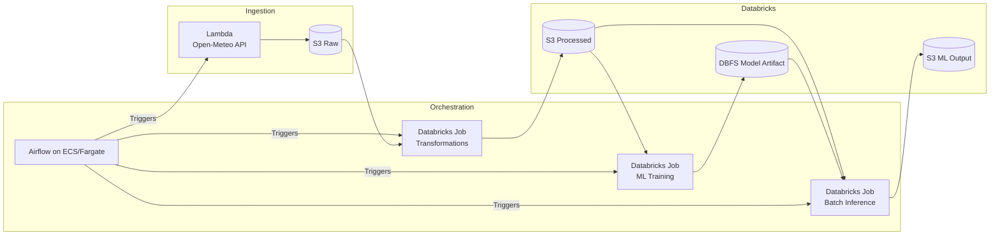

# Weather Data Processing & ML Pipeline

## Objective
Build a production-ready pipeline that ingests public weather data, orchestrates all processing stages through a structured Airflow workflow running on Docker-based infrastructure, and executes a compact ML cycle—feature preparation, training, and batch inference—delivering finalized prediction outputs to S3.

## Tech Stack (Overview)
- **Airflow on ECS/Fargate** – orchestration of ingestion, processing, and ML tasks.
- **AWS Lambda** – lightweight ingestion from the Open-Meteo API.
- **Databricks** – distributed processing and model training/inference.
- **AWS S3** – storage for raw, processed, and ML output layers.
- **Terraform** – full infrastructure provisioning as code.
- **Open-Meteo API** – public weather data source (no authentication).

## Technical Decisions & Trade-offs

### 1. Airflow on ECS/Fargate  
Chosen to avoid EC2 lifecycle management and maintain a fully containerized scheduler/worker environment. Simple scaling and tight integration with CloudWatch. The trade-off is less granular control compared to EC2-based deployments.

### 2. Databricks for Processing and ML  
Provides ready-to-use distributed computing and a native ML workflow without managing Spark clusters manually. Cross-cloud dependency is the trade-off, but operational simplicity outweighs it for this workload.

### 3. Lambda for Ingestion  
Ideal for short, lightweight HTTP calls. No servers, no idle cost. The limitation is execution time and dependency size, which is acceptable because heavy processing occurs in Databricks.

### 4. Open-Meteo as the Data Source  
Public, stable, and requires no authentication or secrets management. This simplifies setup and avoids reliance on Parameter Store. The trade-off is using general-purpose weather data rather than domain-specific feeds.

### 5. No Custom VPC in the First Iteration  
Using the default AWS networking model speeds up deployment and reduces moving parts. It sacrifices private networking and advanced routing options but keeps the pipeline focused on core functionality.

### 6. Clear Functional Separation  
Airflow orchestrates, Lambda ingests, Databricks processes and trains. This minimizes coupling and avoids overloading any single component. The trade-off is increased inter-service communication, which is acceptable given the lightweight interactions.

## Reproduction
1. Clone the repository.  
2. Configure AWS and Databricks credentials locally.  
3. Deploy infrastructure with Terraform.  
4. Push Airflow assets (DAGs, Docker image if applicable).  
5. Trigger the pipeline manually or wait for its scheduled run.

## License
MIT License.
